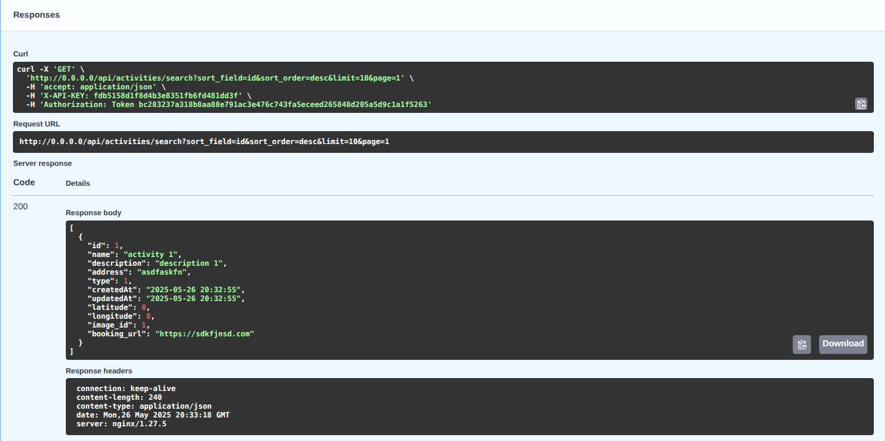
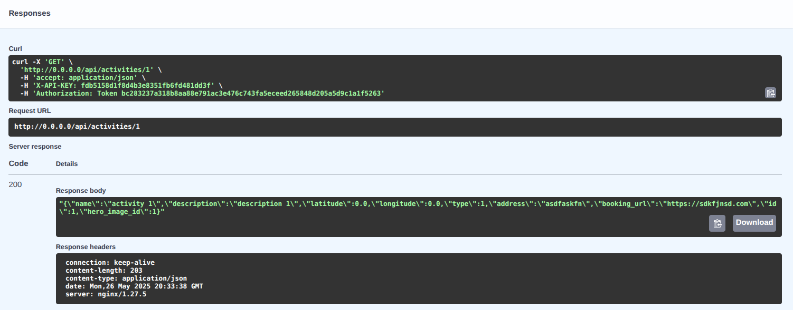
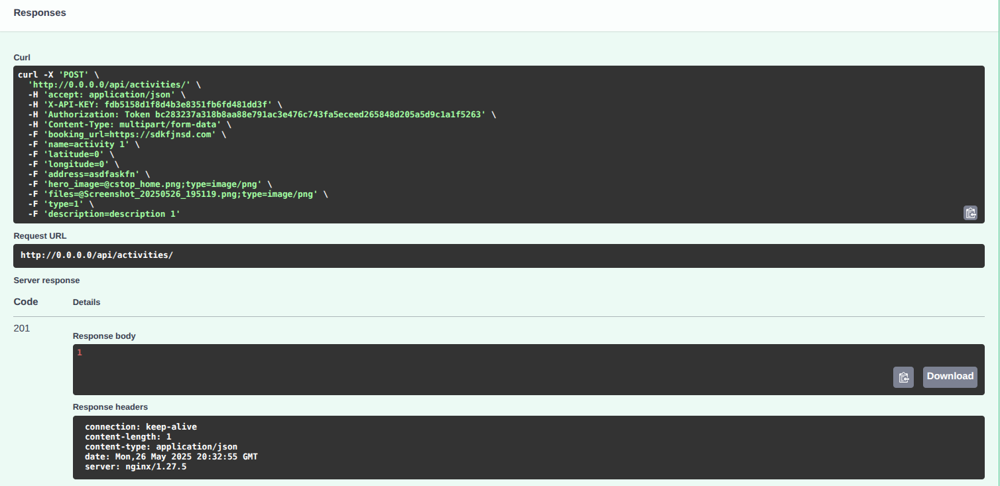
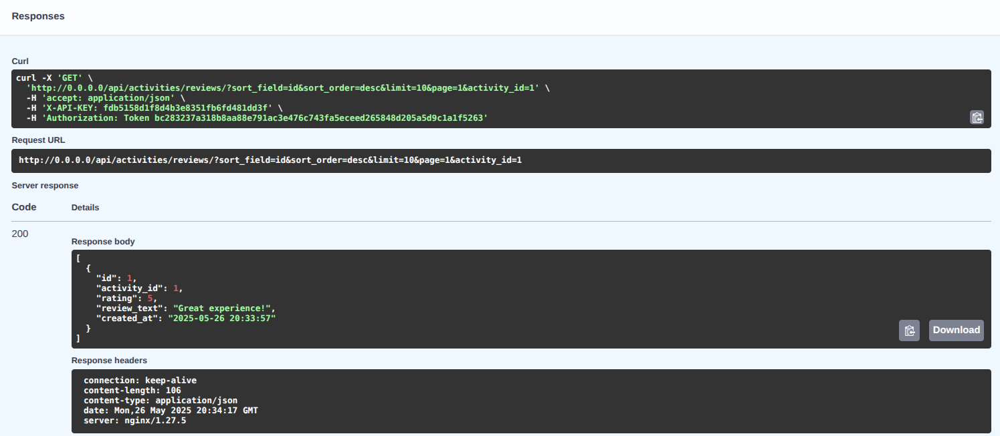
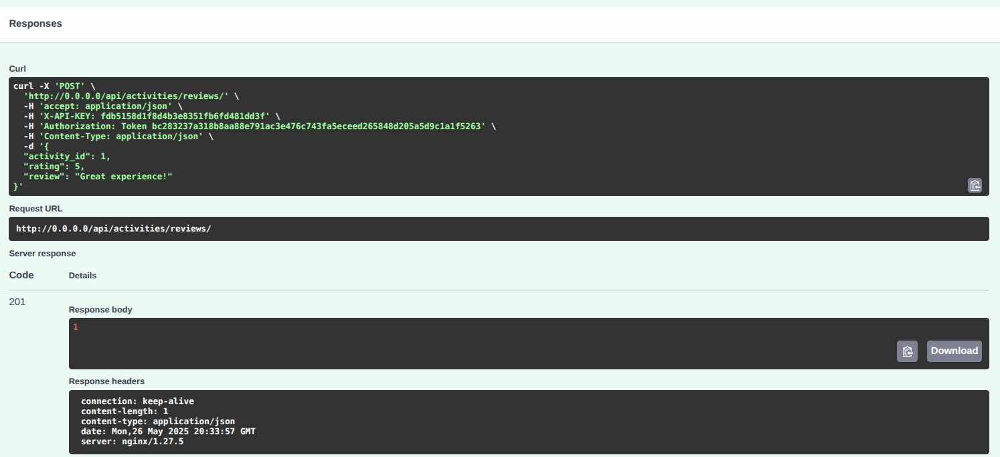

# Overview

This API service provides endpoints for managing activities, activity images, and reviews. It is built using Python and FastAPI, with PostgreSQL as the database. The service supports searching for activities and reviews, creating and updating activities, uploading images, and managing reviews.

# Docker Development setup

## Prerequisites
- docker & docker compose installed
- vscode installed
- auth service running somewhere with an accessible endpoint (e.g. http://auth-service:8000)
   - will be used when testing application via swagger UI or postman
   - in the auth service, create an application and copy the api key 
      - resource permissions set for the application

## Creating the dev environment
- cd into `docker-env-dev` folder
- run `docker-compose up -d` to start the dev environment
   - this will create a development python container, a postgres database container, and a pgadmin container
- run `docker-compose exec app python manage.py migrate` to create the database tables
- in vscode, open the `docker-env-dev-app-1` container in the remote explorer
- open the `/app` folder in the container
- create a new python virtual environment in the container using `python -m venv .venv` (or use the python extension to create a new virtual environment)
- activate the virtual environment using `source .venv/bin/activate` (or use the python extension to activate the virtual environment)
- install the required packages using `pip install -r requirements.txt` (or use the python extension to install the required packages)

## Setting up environment variables
- update the values in example.env, copy all variables (with export word included) and paste them into your terminal


## Setting up the database  (done inside the development container)
- set the DATABASE_URL environment: `export DATABASE_URL=postgresql://postgres:postgres@db/activities-service` 
   - this uses the default credentials for the postgres database container. Change if necessary.
- in the root folder (`/app`), run `bash scripts/applyPendingMigrations.sh` to apply any pending migrations to the database

## Running the application
- in the root folder (`/app`), run `bash scripts/runApp.sh` to start the application

## Running the tests
- the tests require an instance of postgres to be running. In this case we can use the development postgres container created above.
   - In github actions, an instance of postgres must be created for the tests to run.
- make sure to export the DATABASE_URL environment variable as above
- in the root folder (`/app`), run `bash scripts/runTests.sh` to run the tests

# Non-docker Development setup

## Prerequisites
- python 3.10 
- libpq-dev and python3-dev installed (for psycopg2) if using ubuntu/debian
   - run `sudo apt-get install libpq-dev python3-dev`
- pip installed
- virtualenv installed (optional, but recommended)
- virtual environment created (optional, but recommended)
   - `python -m venv .venv` to create a virtual environment in the current directory
- a running instance of postgres
- any IDE
- auth service running somewhere with an accessible endpoint (e.g. http://auth-service:8000)
   - will be used when testing application via swagger UI or postman
   - in the auth service, create an application and copy the api key 
      - resource permissions set for the application

# Instuctions
- fulfill the prerequisites above
- set all of the environment variables shown in the example.env file
- install dependencies using `pip install -r requirements.txt`
- if using any bash shell:
   - run `bash scripts/applyPendingMigrations.sh` to apply any pending migrations to the database
   - run `bash scripts/runApp.sh` to start the application
- if using another shell, copy the relevant commands from the scripts above and run them in your shell


# Using the running application

## Overview of endpoints:

### Activities
- `GET /api/activities/search` - search activities:
      - 
- `GET /api/activities/search/location` - search activities by lat/long and a radius
- `GET /api/activities/{id}` - get activity by id
      - 
- `POST /api/activities` - create activity
      - 
- `POST /api/activities/edit` - update activity by id
- `DELETE /api/activities/{id}` - delete activity by id

### Activity Images
- `GET /api/activities/images/{id}` - get image by id
- `GET /api/activities/images/activity/{id}` - get activity images by activity id
- `POST /api/activities/images/activity/{activity_id}/hero/upload` - upload hero image for activity
- `POST /api/activities/images/activity/{activity_id}/upload` - upload image for activity
- `DELETE /api/activities/images/{id}` - delete image by id

### Reviews
- `GET /api/activities/reviews` - search reviews
      - 
- `POST /api/activities/reviews` - create review
      - 
- `DELETE /api/activities/reviews/{id}` - delete review by id

## Swagger UI

- open the swagger UI at `http://localhost:8000/api/activities/docs` to test the application
   - change the port number if necessary
- in the swagger UI, click on the `Authorize` button and enter the following values:
   ```
      "X-API-KEY": "the secret api key",
      "Authorization": "Token <user_token>"
   ```   
- all of the endpoints will be listed along with the request and response models

## Generate clients

The open api spec can be used to generate clients for use in other applications. For example, to generate a TS client, use the following commands:
```bash
npm install -g nswag

nswag openapi2tsclient /input:"http://localhost:8000/api/activities/openapi.json" /output:client.ts /template:Axios /className:ActivitiesClient /OperationGenerationMode:SingleClientFromOperationId 
```

The example above uses the nswag npm package to generate a typescript client using the openapi spec. The generated client will use axios as the http client and will be named `ActivitiesClient`. The generated file will be saved as `client.ts` in the current directory. The `OperationGenerationMode` is set to `SingleClientFromOperationId` to generate a single client for each operation id. This can be changed to `MultipleClientsFromOperationId` to generate multiple clients for each operation id.