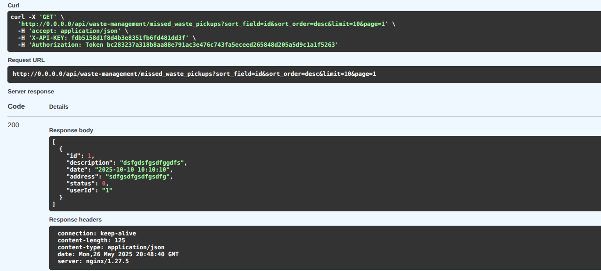
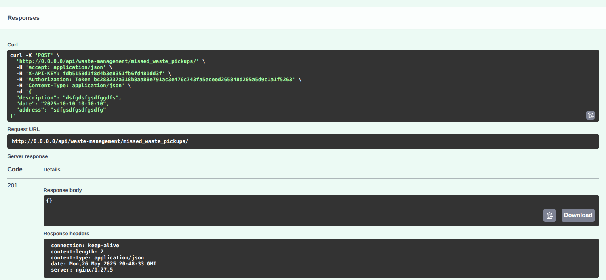
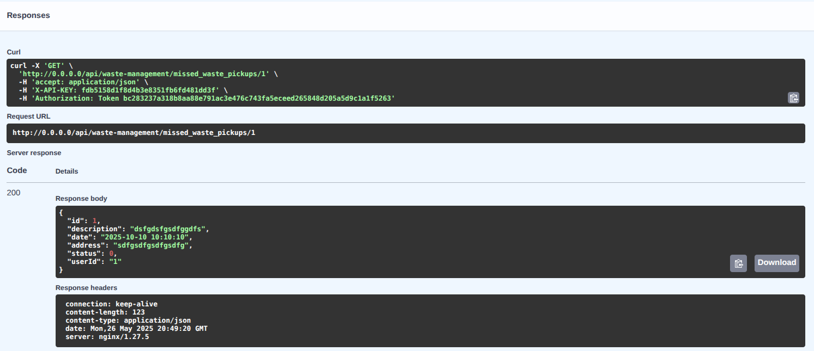

# Overview

This API service is designed to manage missed waste pickups. It allows users to create, search, and update the status of missed waste pickups. The service is built using Python and FastAPI, and it uses PostgreSQL as the database.

# Development Setup

- cd into docker-env-dev and run `docker compose up -d`
- open vscode and connect to app container. Once in the container, open the `/app` folder
- create virtual python env `python -m venv venv`
- install packages `pip install -r requirements.txt`

# Apply migrations

- set `DATABASE_URL` env variable
    - `export DATABASE_URL=DATABASE_URL=postgresql://postgres:postgres@db/waste-management-service`
- run `bash scripts/applyPendingMigrations.sh` from the root folder in the container (folder where run.py file exists)
    - This will apply all pending migrations to the database
    - The script will also create a new database if it does not exist

## Test the app

- run `bash scripts/runTests.sh` from the root folder in the container (folder where run.py file exists)
    - Tests are run using sqlite

## Run the app

- run `bash scripts/runApp.sh` from the root folder in the container (folder where run.py file exists)

### OpenAPI and Swagger UI access

- swagger ui can be accessed at `http://localhost:8004/api/waste-management/docs` once the app is running.
- the full OpenAPI spec can be found at `http://localhost:8004/api/waste-management/openapi.json` 
- in the swagger UI, click on the `Authorize` button and enter the following values:
   ```
      "X-API-KEY": "the secret api key",
      "Authorization": "Token <user_token>"
   ```   
- all of the endpoints will be listed along with the request and response models

## Overview of endpoints:

### waste-management
- `GET /api/waste-management/missed_waste_pickups` - search missed waste pickups
      - 
- `POST /api/waste-management/missed_waste_pickups` - create missed waste pickup
      - 
- `POST /api/waste-management/update_status` - update status of missed waste pickup by id
- `GET /api/waste-management/missed_waste_pickups/{id}` - get missed waste pickup by id
      - 
